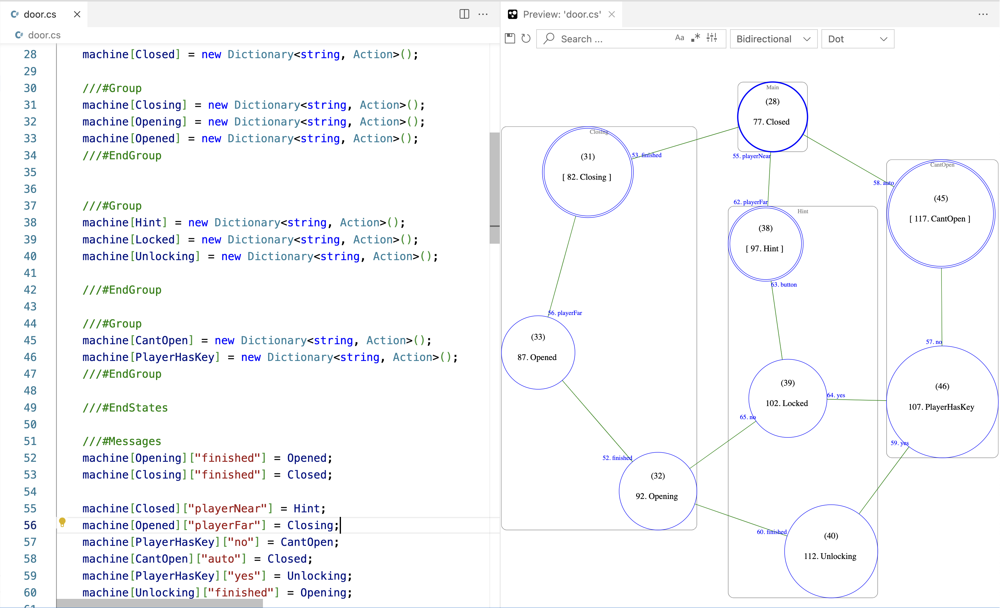

# FSM C# Interactive Preview (Visual Studio Code Extension)

A VSCode extension that provides Finite State Machine diagrams, zoom-, pan-, live preview powered by Graphviz.



Test code:

```
using MessageDict = System.Collections.Generic.Dictionary<string, System.Action>;

using MachineDict = System.Collections.Generic.Dictionary<System.Action, System.Collections.Generic.Dictionary<string, System.Action>>;

Action currentState = delegate {};
Dictionary<Action, Dictionary<string, Action>> machine;
Dictionary<string, Action> messages;

machine = new Dictionary<Action, Dictionary<string, Action>>();
messages = new Dictionary<string, Action>();

void InitMachine() 
{
    ///  bgcolor = gray12
    /// node [fontcolor = white];
    /// node [color = yellow];
    /// edge [fontcolor = orange]
    
    ///#Dot
    /// 
    /// start = 15;
    /// node [shape=circle];
    /// edge [len=5];

    ///#EndDot
    
    ///#States  
    machine[Closed] = new Dictionary<string, Action>();
    
    ///#Group
    machine[Closing] = new Dictionary<string, Action>();
    machine[Opening] = new Dictionary<string, Action>();
    machine[Opened] = new Dictionary<string, Action>();
    ///#EndGroup

  
    ///#Group
    machine[Hint] = new Dictionary<string, Action>();
    machine[Locked] = new Dictionary<string, Action>();
    machine[Unlocking] = new Dictionary<string, Action>();

    ///#EndGroup

    ///#Group
    machine[CantOpen] = new Dictionary<string, Action>();
    machine[PlayerHasKey] = new Dictionary<string, Action>();
    ///#EndGroup

    ///#EndStates

    ///#Messages
    machine[Opening]["finished"] = Opened;
    machine[Closing]["finished"] = Closed;
   
    machine[Closed]["playerNear"] = Hint;
    machine[Opened]["playerFar"] = Closing;
    machine[PlayerHasKey]["no"] = CantOpen;
    machine[CantOpen]["auto"] = Closed;
    machine[PlayerHasKey]["yes"] = Unlocking;
    machine[Unlocking]["finished"] = Opening;

    machine[Hint]["playerFar"] = Closed;
    machine[Hint]["button"] = Locked;
    machine[Locked]["yes"] = PlayerHasKey;
    machine[Locked]["no"] = Opening;
    ///#EndMessages

    currentState = Red;
    messages = machine[currentState];
}

void _SendMessage(String msg) {
    currentState = messages[msg];
    messages = machine[currentState];
}

void Closed()  {
    Console.WriteLine("Red");
    _SendMessage("next");
}

void Closing()  {
    Console.WriteLine("Red");
    _SendMessage("next");
}

void Opened()  {
    Console.WriteLine("Red");
    _SendMessage("next");
}

void Opening()  {
    Console.WriteLine("Red");
    _SendMessage("next");
}

void Hint()  {
    Console.WriteLine("Red");
    _SendMessage("next");
}

void Locked()  {
    Console.WriteLine("Red");
    _SendMessage("next");
}

void PlayerHasKey()  {
    Console.WriteLine("Red");
    _SendMessage("next");
}

void Unlocking()  {
    Console.WriteLine("Red");
    _SendMessage("next");
}

void CantOpen()  {
    Console.WriteLine("Red");
    _SendMessage("next");
}


InitMachine();

Console.WriteLine("Init");

currentState();
currentState();
currentState();
currentState();
currentState();
currentState();
currentState();
currentState();
currentState();

```


## Interactivity Features
* Renders dot/Graphviz sources in an interactive live preview.
* Updates preview as you type.
* Export the graph as `svg` or `dot`.


## How to preview

Open a C# file in the active editor and use either of the following methods to render the preview:

* Open the command prompt (<kbd>cmd</kbd>+<kbd>shift</kbd>+<kbd>p</kbd>) and type  `> FSM CSharp Interactive Preview`


## Development
You may need to fix folder issues
```
sudo chown -R $(whoami) /usr/local/lib/node_modules/
sudo chmod -R 775 /usr/local/lib/node_modules/
```
Install Dependencies:
```
npm install
npm audit fix 
```
Before running the project
```
npm run watch
```

## Credits

* Forked from Graphviz Interactive Preview: [link here](https://github.com/tintinweb/vscode-interactive-graphviz)


-----------------------------------------------------------------------------------------------------------
